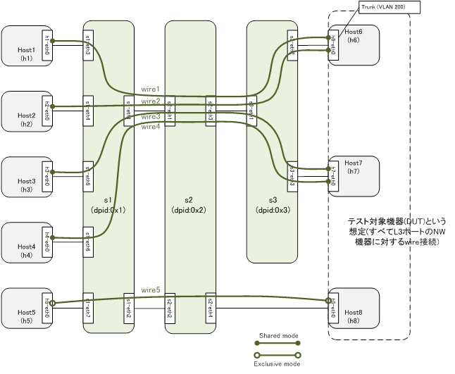

# L1patch応用NWテストシステムプロジェクト サンプルプログラムReadme  

## このプロジェクトについて  
  従来、ネットワークの試験を実施する際には、大量の物理的な機材・配線を用意して、物理配線や疎通試験の作業を人手で行う必要があり、問題となっておりました。本プロジェクトでは、SDNの技術を使うことでこれらの問題の解決を目指し、上記の各社からネットワーク試験の経験と技術を持つ技術者が協力し、課題を共有、議論することで研究を進めてまいりました。  

## 本プロジェクトの成果物について  
  現在、沖縄オープンラボラトリのホームページにてプロジェクトの成果物を公開に向けて準備中です。  
  https://www.okinawaopenlabs.org/  

  また、このリポジトリのreportディレクトリに研究レポートを保存しております。  
  https://github.com/oolorg/ool-l1patch-dev/tree/master/report  

  プロジェクトの内容にご興味のある方は研究レポートをご参照いただくか、こちらまでお問い合わせください。  
  ＜本件に関するお問い合わせ＞  
  一般社団法人沖縄オープンラボラトリ  
  L1Patch応用NWテストシステムPJ 担当  
  Mail:

# L1patchの使用方法  
  このReadmeではサンプルシナリオ(`scenario_pattern_topo2_simple.json`, [リンク](scenario_pattern_topo2_simple.json))を元にサンプルプログラムの使用方法について説明します。  
  机上テストでは以下の点のテストが可能となるようにしています。  
  * L2制御を用いた1:N接続
  * L1制御を用いた1:1接続
  上記接続を設定したうえでトラフィック(Ping)による疎通試験にて各ホスト・DUT(h1〜h7)から疎通の正常性を確認します。  


  * この試験環境で試験する環境と構成について  
  今回のサンプルプログラムを実行するための構成図は下記のとおりです。  


  

  机上テストでは、すべてのノード(h1-h8)は同じサブネットのIPアドレスを持ちます。  
  h6～h8はテスト対象機器(DUT)で、構成図に記載したとおりL3ポートを持つNW機器に相当しますが、実際にはMininet   hostで代替しているだけなのでルーティングやフォワーディング動作は行われません。したがって、この環境ではワイヤで結ばれた2ノード間だけが通信可能になります。  

  * 試験の内容と目的  
    * L2制御を用いた1:N接続  
     - DUT側がVLAN trunk portとなっており、異なるセグメントの複数のテスト用ノード接続を受け入れる: wire1, wire2
     - DUT側がVLAN access portとなっており、同一セグメント内の複数のテスト用ノード接続を受け入れる: wire3, wire4
    * L1制御を用いた1:1接続  
    上記接続を行ったうえで、コマンドからの手動実行・サンプルプログラムからの自動実行によりトラフィック(Ping)を流して各ネットワークの正常性を確認することが目的となります。  


##	L1patch環境のセットアップ  
  今回のサンプルプログラムにて使用しているソフトウェアとバージョンは下記の通りです。  

  * Mininet2.2.22以降
  * Ryu3.24以降
  * Open vSwitch 2.0以降
  * Python2.7系

##  各種設定ファイルの準備
  このサンプルプログラムでは下記の４つのファイルを作成する必要がある  

  * 物理情報の定義(`nodeinfo_topo2.json`, [リンク](nodeinfo_topo2.json))  
    このファイルでは実際に物理的に接続されている機器の情報と接続するMininetのノードの情報を定義しているファイルです。  
    ファイル内でMininetで生成される試験ノードのIPや物理的に接続している接続しているWhiteboxスイッチのポート情報、物理  的に接続されている機器の接続情報を定義する。  

  * 論理情報の定義(`wireinfo_topo2.json`, [リンク](wireinfo_topo2.json))  
    L1Patchで作成する論理接続の情報を定義しているファイルです。  
    各ネットワーク機器と試験ノードのデータプレーンの接続構成を設定ファイルで定義します。  


  * テストシナリオの定義(`scenario_pattern_topo2_simple.json`, [リンク](scenario_pattern_topo2_simple.json))    
    試験ノード間のどこからどこにトラフィック(Ping)を流すのかを設定する定義ファイル。  
    各試験ノード設定とトラフィック(Ping)を流す始点と終点の設定、想定される結果を設定する。  

  * テスト自動実行定義(`testdefs_topo2.json`, [リンク](testdefs_topo2.json))  
    試験の自動実行を行うための定義ファイル。  
    実行する試験でどの設定ファイルを使って試験をするかやテスト環境のOpenFlowのバージョン、シナリオで使用する試験用のコマ  ンドを定義する。  

##  OpenFlowコントローラの起動
  下記のコマンドにてOpenFlowコントローラを起動することができます。
  hoge@prjexp01:~/l1patch-dev$ ryu-manager --verbose patch_ofc.py  
  ※サンプルのOFCのREST API URLはlocalhost:8080

##  L1patchの実行(手動操作モード)
  下記のコマンドを実行することで手動操作での試験を実行することが可能です。
  hoge@prjexp01:~/l1patch-dev$ sudo python run_scenario_test.py -f testdefs_topo2.json --all-layers   --manual

  上記を実行するとMininet CLIに入ります。  
  下記のコマンドを実行することで試験環境にて主導操作での試験や確認を実行することができます。

  - `h1 ping h6`  
    ホストh1からホストh6へのPing実行(ホストh1、h6は目的のホストに書き換えて使用してください)
  - `pingall`  
    シナリオファイルにて指定しているテストトラフィックのパターンに基づいてトラフィック(Ping)を送信します。
  - `dpctl dump-flows`  
    L1Patchで作成したOpenFlowのFlowがすべて表示されます

  - ●コマンドの実行例：
  ```
  mininet> pingall  
  *** Ping: testing ping reachability  
  h1 -> X X X X h6 X X  
  h2 -> X X X X h6 X X  
  h3 -> X X X X X h7 X  
  h4 -> X X X X X h7 X  
  h5 -> X X X X X X h8  
  h6 -> h1 h2 X X X X X  
  h7 -> X X h3 h4 X X X  
  h8 -> X X X X h5 X X  
  *** Results: 82% dropped (10/56 received)  
  mininet>  
  ```  

##  L1patchの実行(自動実行モード)

  下記コマンドにて作成したシナリオ(testdefs_topo2.json)にしたがって試験を実行します。  
  hoge@prjexp01:~/l1patch-dev$ sudo python run_scenario_test.py -f testdefs_topo2.json --all-layers
  実行が終わったら結果についてはtest_result_topo2.mdとして生成されますので、ご確認ください。  

##  応用試験  
  応用編として、テスト定義の中で指定するサンプルのテストシナリオファイルをご用意しました。`scenario_pattern_topo2.json`[リンク](scenario_pattern_topo2.json)    
  こちらの試験は一部トラフィック(Ping)が通らないことを確認するためのシナリオが含まれております。
  ご興味のある方はこちらも実行してみてください。
